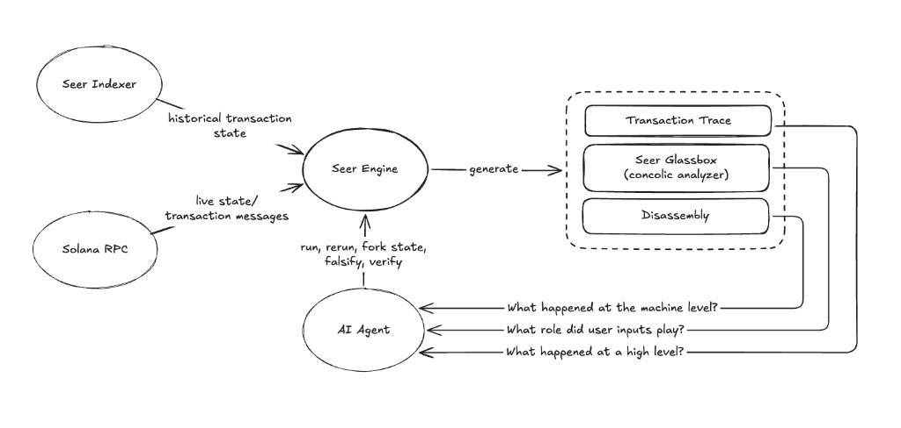

# Seer

Seer is an execution-analysis engine for Solana.

Ingests indexed transaction state for byte-perfect historical replay, local state for development and testing, and mainnet state for experimentation.

Cracks open closed-source programs using three layers of analysis.

Built with love for Solana developers, auditors, and on-chain incident responders. Intended to act as part of the [STRIDE framework](https://stride.asymmetric.re/) through composability with existing monitoring solutions. 



1. **Trace** – account state between instructions, and program source when it exists. Equivalent level of detail to explorers. Enough for easy cases. Clarity depends on program source and an IDL. 
2. **Disassembly** – full steps and registers of the transaction. Too much to read straight through. Indispensable for lookup once the shape of execution is already known.
3. **Glassbox** – a [concolic](https://en.wikipedia.org/wiki/Concolic_testing) engine. A custom Solana symbolic virtual machine which turns execution into conditional statements over the instruction and account input bytes, annotated from known IDLs and the input layout. On experimental sets this cuts +70,000 steps to +1,000 statements, small enough to analyze. Most failures are in the last 10.

## Agents

```
seer skill
seer skill install
```

`skill` prints the agent instructions for this CLI. `skill install` writes them into the user skill directories for Cursor, Claude Code, Codex, and other skill-using agents. Re-run install after upgrading `seer`.

## Getting started

### Install

macOS and Linux:

```
curl -sSfL https://github.com/SeerApp/seer/releases/latest/download/install.sh | sh
```

Windows (PowerShell):

```
irm https://github.com/SeerApp/seer/releases/latest/download/install.ps1 | iex
```

The installer downloads one archive for your OS and CPU: `seer` (`seer.exe` on Windows) and the `libz3` that archive was linked against. Unix installs into `$HOME/.local/bin` or `/usr/local/bin`. Windows installs into `%LOCALAPPDATA%\seer`. The library is unpacked next to the binary. A release install does not need a separate Z3.

```
curl -sSfL https://github.com/SeerApp/seer/releases/latest/download/install.sh | sh -s -- --prefix /usr/local/seer
```

Linux x86_64 builds of Z3 4.15.3 need glibc 2.39 or newer. Ubuntu 24.04 works. Ubuntu 22.04 does not.

### Replay a signature

Live accounts, as that RPC sees them now:

```
seer run --sig <SIGNATURE> --url https://api.mainnet-beta.solana.com
```

Accounts from the signature's historical state. The RPC is used only for the transaction message. Accounts come from a local mainnet cache, or from `https://tx.seer.run`. A missing account fails the run.

```
seer run --sig <SIGNATURE> --url https://api.mainnet-beta.solana.com --historical
```

`SEER_RPC` sets the default URL. `--storage-home <DIR>` picks where runs are stored.

## What a run can answer

A run is one execution: a transaction message plus the accounts it executed against. You refer to it by id (`1`, `2`, …).

Commands print JSON on stdout. A footer suggests the next command. `--short` prints compact JSON and omits the footer.

### What happened

```
seer show 1
seer show 1 --trace
seer show 1 --tx
seer show 1 --state
seer show 1 --account <PUBKEY>
seer show 1 --data <PUBKEY>
```

`show` with no flags is the run record. `--trace` is the instruction tree: named instructions, logs, and account diffs. `--tx` is the message. `--state`, `--account`, and `--data` are the input accounts.

### What the program did

```
seer program <PUBKEY> --run 1 --disasm
seer program <PUBKEY> --run 1 --lifted
seer regs 1 --ix 0
```

`--disasm` is the static listing. `--lifted` is the control-flow graph. Pass exactly one of them. Window with `--pc`, `--start`/`--end`, or `--contains`. The default prints the first 20 lines or blocks.

`regs` prints r0–r10 at recorded steps of one instruction. Window with `--start`/`--end` or `--order`. `--changed` keeps steps where the selected registers moved. `--reg 0,1` selects which registers `--changed` watches.

### Which inputs a branch depended on

```
seer glassbox 1 --ix 0
```

`--taken-only` drops conditions that were not taken. `--force` recomputes the stored report.

## Fork the state

```
seer run --from 1 --account <PUBKEY> --lamports 0
```

`--from` replays the parent transaction against a patched copy of its accounts. Also `--owner`, `--data`, and `--executable`.

`--sigverify` and `--blockhash-check` take `true` or `false`. They are stored on the run and copied by `--from`.

```
seer diff 1 2
seer ls
seer ls --tree --from 1
```

`diff` compares two runs. `ls` lists them. `ls --tree` shows fork lineage.

## Build from source

Install Z3, then cargo.

macOS:

```
brew install z3 pkg-config
```

Debian / Ubuntu:

```
sudo apt install libz3-dev pkg-config
```

Windows: unpack the zip named in `z3-pin` for `x86_64-pc-windows-msvc`. Set `Z3_SYS_Z3_HEADER` to that `include\z3.h` and `Z3_LIBRARY_PATH_OVERRIDE` to the directory with `libz3.lib` / `libz3.dll`.

The same pin on Unix, if you want CI's bits:

```
export Z3_SYS_Z3_HEADER=/path/to/include/z3.h
export Z3_LIBRARY_PATH_OVERRIDE=/path/to/bin
```

Build from this repo. Cargo fetches the Agave, LiteSVM, and SBPF git dependencies.

```
cargo build -p seer --release
```

That binary uses the Z3 you installed. It is not the GitHub release archive. Z3 4.15.x matches the `z3` 0.20.2 crate. `Cargo.lock` does not pin Microsoft Z3. `seer glassbox` needs a working libz3 either way: next to a release binary, or the one you installed above.