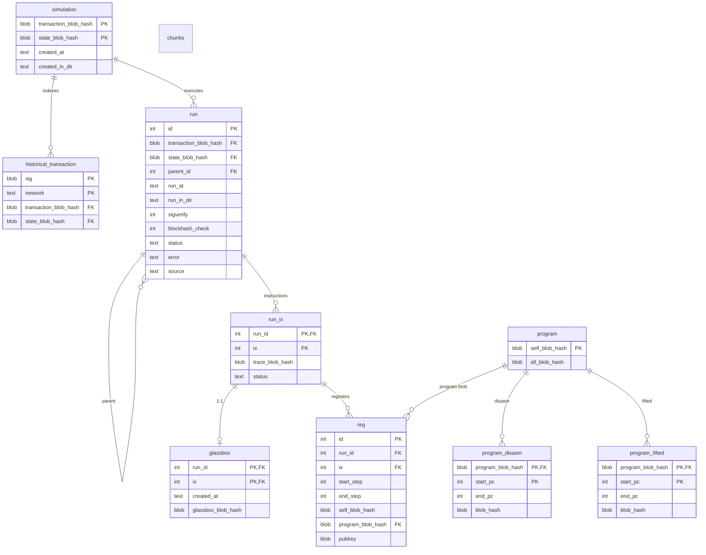

# Storage

SQLite tables plus a content-addressed blob directory. Blob hashes (32 bytes) name files, not SQL rows, except where a column is a foreign key to another table.

```mermaid
erDiagram
    simulation {
        blob transaction_blob_hash PK
        blob state_blob_hash PK
        text created_at
        text created_in_dir
    }

    historical_transaction {
        blob sig PK
        text network PK
        blob transaction_blob_hash FK
        blob state_blob_hash FK
    }

    run {
        int id PK
        blob transaction_blob_hash FK
        blob state_blob_hash FK
        int parent_id FK
        text run_at
        text run_in_dir
        int sigverify
        int blockhash_check
        text status
        text error
        text source
    }

    run_ix {
        int run_id PK, FK
        int ix PK
        blob trace_blob_hash
        text status
    }

    glassbox {
        int run_id PK, FK
        int ix PK, FK
        text created_at
        blob glassbox_blob_hash
    }

    program {
        blob self_blob_hash PK
        blob idl_blob_hash
    }

    program_disasm {
        blob program_blob_hash PK, FK
        int start_pc PK
        int end_pc
        blob blob_hash
    }

    program_lifted {
        blob program_blob_hash PK, FK
        int start_pc PK
        int end_pc
        blob blob_hash
    }

    reg {
        int id PK
        int run_id FK
        int ix FK
        int start_step
        int end_step
        blob self_blob_hash
        blob program_blob_hash FK
        blob pubkey
    }

    simulation ||--o{ historical_transaction : indexes
    simulation ||--o{ run : executes
    run ||--o{ run : parent
    run ||--o{ run_ix : instructions
    run_ix ||--o| glassbox : "1:1"
    run_ix ||--o{ reg : registers
    program ||--o{ reg : "program blob"
    program ||--o{ program_disasm : disasm chunks
    program ||--o{ program_lifted : lifted chunks
```
